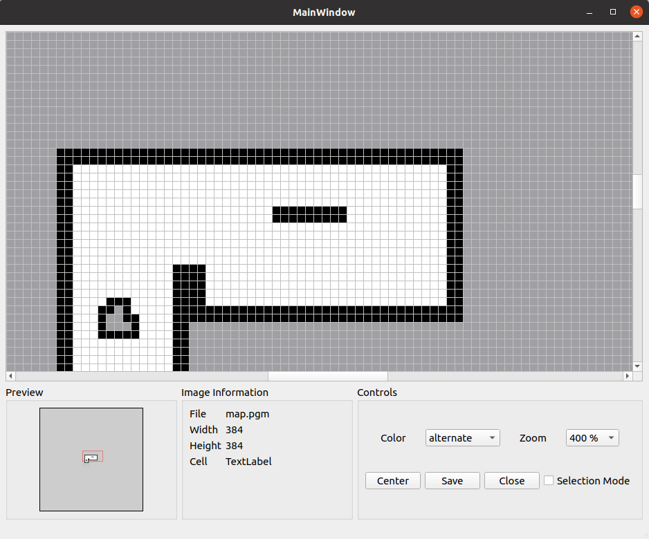

# ROS Map Editor

A GUI tool for editing ROS map files in PGM format. This tool allows you to view and modify occupancy grid maps used in ROS (Robot Operating System) navigation.



## Acknowledgements

- [https://github.com/TheOnceAndFutureSmalltalker/ros_map_editor](https://github.com/TheOnceAndFutureSmalltalker/ros_map_editor)

## Features

- Load and display PGM map files used in ROS
- Edit map cells (occupied, free, unknown)
- Zoom in/out for detailed editing
- Minimap for navigation in large maps
- Automatically saves changes on exit

## TODO

- [x] BOX Select


- [x] Line Select


- [ ] Polygon Select
- [ ] Rapidly Loading and Editing

## Installation

### From PyPI

```bash
pip install ros-map-editor
```

### From Source

```bash
git clone https://github.com/sujit-168/ros_map_editor.git -b main
cd ros_map_editor
pip install -e .
```

## Usage

### Command Line

```bash
ros-map-editor path/to/your/map
```

or simply:

```bash
python3 ros_map_editor/main.py path/to/your/map
```

The tool will automatically look for the corresponding YAML file (map.yaml) in the same directory.

### Interface

- **Zoom**: Select zoom level from the dropdown menu
- **Color**: Choose what to draw:
  - **Occupied**: Mark cells as obstacles (black)
  - **Free**: Mark cells as free space (white)
  - **Unknown**: Mark cells as unknown (gray)
  - **Alternate**: Cycle through states with each click
- **Minimap**: Shows your current position in the map with a red rectangle
- **Drawing**: Click or drag to modify cells

## Map File Format

The tool works with standard ROS map files:

- A PGM image file containing the occupancy grid
- A YAML file with metadata (resolution, origin, thresholds)

Example YAML file:

```yaml
image: map.pgm
resolution: 0.050000
origin: [-10.000000, -10.000000, 0.000000]
negate: 0
occupied_thresh: 0.65
free_thresh: 0.196
```

## Requirements

- Python 3.6+
- PyQt5
- Pillow (PIL)
- PyYAML

## License

Public domain

## Contributing

Contributions are welcome! Please feel free to submit a Pull Request.
